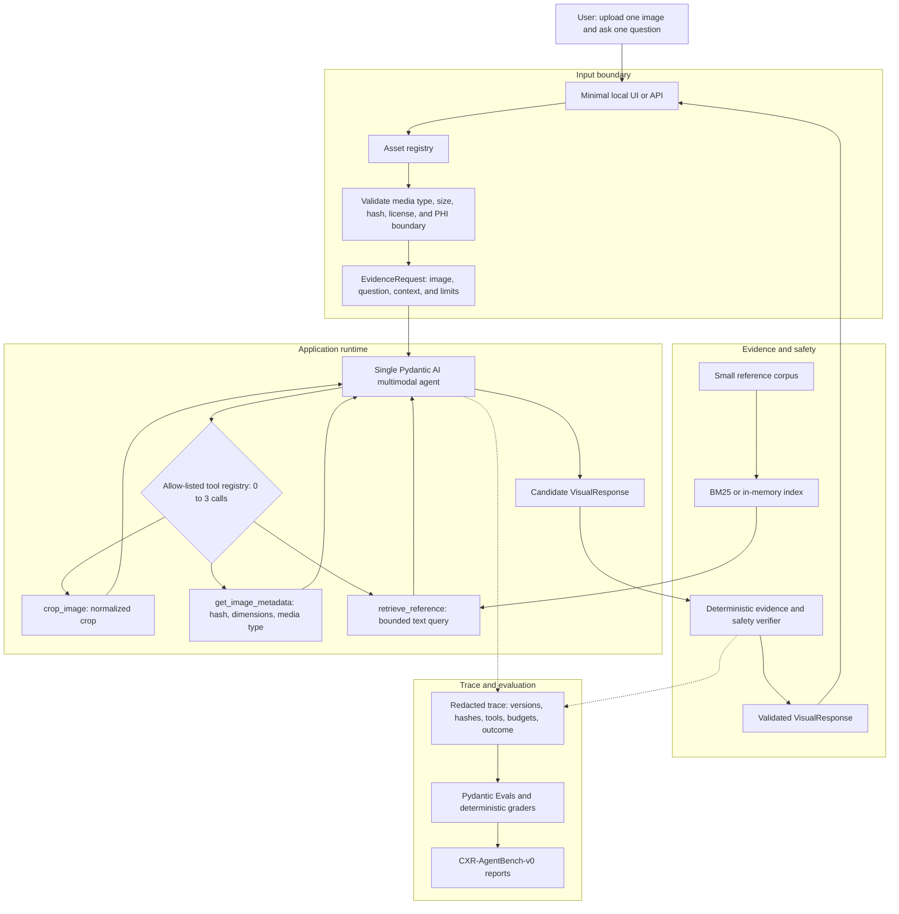

# Chest X-ray Evidence Assistant

A small, non-diagnostic text-and-vision assistant that produces structured,
evidence-linked observations for one allowed chest X-ray and one text question.

## Goal

Accept one synthetic, de-identified, demo, or appropriately licensed image and
a question, then return a typed response containing:

- observations and uncertainty;
- evidence tied to image regions;
- optional reference evidence with source provenance; and
- one of `answered`, `needs_clarification`, or `abstain`.

The default path is offline and deterministic. Live model providers are
optional, and invalid or insufficient inputs must fail closed.

## Architecture



The request flow is:

1. Validate the uploaded image and question.
2. Register the image with a server-owned ID and bounded metadata.
3. Run one Pydantic AI multimodal agent.
4. Let the agent call at most three typed tools: crop/zoom, image metadata, and
   reference retrieval.
5. Return tool results to the agent, then pass its candidate response to the
   deterministic verifier.
6. Verify evidence locators, source provenance, confidence, status, and runtime
   limits before returning a `VisualResponse`.
7. Store only redacted trace metadata for evaluation and reproducibility.

The current code implements the contract and fixture layers. The agent, tools,
retrieval, verifier, UI, and deployment layers will be added incrementally.

## Contracts

`src/chest_xray_evidence_assistant/models.py` defines the provider-neutral
interfaces:

- `EvidenceRequest` and `QuestionContext` for user input;
- `ImageAsset` for bounded image metadata and provenance;
- `VisualEvidence` and `ImageLocator` for grounded image claims;
- `SourceEvidence` for document and URL provenance;
- `RunLimits` for tool, model, image, output, timeout, and cost budgets; and
- `VisualResponse` for answers, clarification, abstention, uncertainty, and
  trace metadata.

`data/fixtures/manifest.json` records the hash, dimensions, size, origin, and
intended use of every committed synthetic fixture.

## Project status

Implemented:

- strict Pydantic contracts;
- deterministic synthetic image fixtures;
- fixture manifest and file verification; and
- deterministic fake response tests.

Planned:

- one opt-in multimodal agent;
- the three bounded tools;
- provenance-preserving retrieval;
- deterministic safety verification;
- a minimal local UI; and
- benchmark, evaluation, and Docker smoke workflows.

## Safety scope

This project does not diagnose disease, prescribe treatment, access PACS/EHR
systems, process real patient records, or make external clinical decisions.
The initial release uses no real clinical data. A second agent, segmentation
model, fourth tool, or EHR integration requires a separate evaluation before it
is added.

## Development

```bash
uv run --group dev pytest -q
uv run --group dev ruff format --check .
uv run --group dev ruff check .
uv run --group dev python -m compileall -q src tests scripts
uv run --group dev python scripts/generate_fixtures.py
```

The detailed staged implementation plan is maintained in the project planning
capsule outside this repository.
