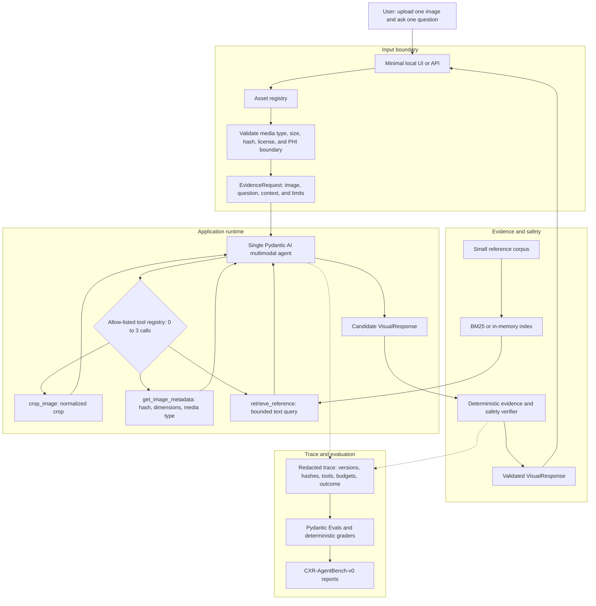

# Chest X-ray Evidence Assistant

A small, non-diagnostic text-and-vision assistant that produces structured,
evidence-linked observations for one allowed chest X-ray and one text question.

## Goal

Accept one synthetic, de-identified, demo, or appropriately licensed image and
a question, then return a typed response containing:

- observations and uncertainty;
- evidence tied to image regions;
- optional reference evidence with source provenance; and
- one of `answered`, `needs_clarification`, or `abstain`.

The default path is offline and deterministic. Live model providers are
optional, and invalid or insufficient inputs must fail closed.

## Architecture



The request flow is:

1. Validate the uploaded image and question.
2. Register the image with a server-owned ID and bounded metadata.
3. Run one Pydantic AI multimodal agent.
4. Let the agent call at most three typed tools: crop/zoom, image metadata, and
   reference retrieval.
5. Return tool results to the agent, then pass its candidate response to the
   deterministic verifier.
6. Verify evidence locators, source provenance, confidence, status, and runtime
   limits before returning a `VisualResponse`.
7. Store only redacted trace metadata for evaluation and reproducibility.

The current code implements the contracts, deterministic fixtures, provider-
neutral model port, bounded fake-model agent, opt-in OpenAI/Ollama model
factory, fingerprinted one-shot baseline, three-tool execution boundary, and
owned offline benchmark.
Crop and metadata adapters work against server-owned image IDs. Reference
retrieval uses a manifest-verified, license-cleared local corpus and a
deterministic in-memory BM25 index; final source evidence must match an exact
authorized retrieval result. A cost-bearing live call remains explicitly
opt-in.

## Contracts

`src/chest_xray_evidence_assistant/models.py` defines the provider-neutral
interfaces:

- `EvidenceRequest` and `QuestionContext` for user input;
- `ImageAsset` for bounded image metadata and provenance;
- `VisualEvidence` and `ImageLocator` for grounded image claims;
- `SourceEvidence` for document and URL provenance;
- `RunLimits` for tool, model, image, output, timeout, and cost budgets; and
- `VisualResponse` for answers, clarification, abstention, uncertainty, and
  trace metadata.

`data/fixtures/manifest.json` records the hash, dimensions, size, origin, and
intended use of every committed synthetic fixture.

## Project status

Implemented:

- strict Pydantic contracts;
- deterministic synthetic image fixtures;
- fixture manifest and file verification;
- deterministic fake response tests;
- a provider-neutral model adapter;
- a bounded Pydantic AI path exercised with a deterministic fake model;
- an environment-only, opt-in OpenAI/Ollama provider factory and smoke path;
- a repeatable, fingerprinted one-shot/no-tool baseline capture;
- deterministic crop and metadata adapters for verified grayscale PNG fixtures;
- immutable, content-addressed reference records and an auditable local corpus;
- deterministic BM25 retrieval with an adapter seam for later dense or hybrid
  indexes;
- source-evidence authorization against exact retrieved chunks;
- parent-owned request, tool, image, output, timeout, repair, and cost budgets;
- a three-name allow-listed dispatcher with redacted, replayable tool records;
- a local-only Gradio demo with fixture attestation, safe fallback states, and
  redacted evidence and execution details;
- `CXR-AgentBench-v0`: 40 byte-attested synthetic images and 120 prompts with
  image-level development, validation, and test splits;
- deterministic graders plus Pydantic Evals reports for answers, evidence,
  tools, trajectories, budgets, and safety;
- retrieval-only RAGAS ID precision/recall with an independent deterministic
  safety gate;
- a repeatable five-configuration offline ablation matrix;
- structured redacted success and failure traces with one replay identity;
- self-validating evaluation manifests that bind provider, model, prompt,
  corpus, configuration, schema, and framework versions;
- a non-root, read-only Docker/Compose fake-model deployment with a real HTTP
  upload-and-submit smoke;
- deterministic p50/p95 latency, request, tool, token, cost, and budget samples;
  and
- one-attempt safe degradation for unavailable model, image-tool, and retrieval
  dependencies, with stable redacted failure codes.

Planned: evidence-backed expansion decisions for optional later capabilities.

## Safety scope

This project does not diagnose disease, prescribe treatment, access PACS/EHR
systems, process real patient records, or make external clinical decisions.
The initial release uses no real clinical data. A second agent, segmentation
model, fourth tool, or EHR integration requires a separate evaluation before it
is added.

## Development

```bash
uv run --group dev pytest tests/unit tests/safety
uv run --group dev --group agent pytest tests/integration
uv run --group dev --group agent pytest -q
uv run --group dev --group agent --group live pytest -q
RAGAS_DO_NOT_TRACK=true uv run --group dev --group eval pytest tests/evals -q
uv run --group dev ruff format --check .
uv run --group dev ruff check .
uv run --group dev python -m compileall -q src tests scripts
uv run --group dev python scripts/generate_fixtures.py
uv run --group agent python scripts/capture_baseline.py
```

### Offline benchmark

Regenerate and verify the owned benchmark, then run the complete matrix:

```bash
uv run python scripts/generate_benchmark.py
RAGAS_DO_NOT_TRACK=true uv run --group eval python \
  -m chest_xray_evidence_assistant.evals.run_benchmark \
  --dataset data/benchmark/cxr-agent-bench-v0.jsonl \
  --output artifacts/evaluation/latest
```

The matrix compares text-only, one-shot vision, vision plus metadata tools,
vision plus retrieval, and the full bounded capability set on identical cases,
prompts, seeds, limits, and rubrics. Pydantic Evals handles agent behavior;
RAGAS runs only ID-based context precision and recall on retrieval cases and
cannot override the deterministic safety result.

This default runner is a scripted offline harness, not a live VLM evaluation.
Its token and latency fields are explicitly labeled deterministic estimates;
its scores establish evaluator, provenance, and ablation wiring, not clinical
accuracy, provider quality, real latency, or cost. Reports are written beneath
`artifacts/evaluation/`; the committed summary fixture detects unexplained
metric or fingerprint drift.

The evaluation group pins RAGAS 0.3.9 and LangChain Community 0.3.x because
[RAGAS 0.4.3 has a confirmed top-level import defect with current LangChain
Community](https://github.com/vibrantlabsai/ragas/issues/2745). Telemetry is
disabled before RAGAS is imported.

### Local offline demo

Launch the UI without credentials, network model access, or a paid call:

```bash
uv run --group agent --group ui python app.py
```

Open `http://127.0.0.1:7860`, upload one of the exact PNG files from
`data/fixtures/images/`, keep the displayed synthetic-demo question, confirm
that the file contains no patient data, and run the check. Any unregistered
image fails closed. Use `--port <1024-65535>` to select another local port.

### Docker offline demo

Build and start the same credential-free fake-model UI, run its complete HTTP
upload and queued-submit smoke inside the container, then stop it cleanly:

```bash
docker compose config --quiet
docker compose up --build --wait
docker compose exec -T ui /app/.venv/bin/python \
  -m chest_xray_evidence_assistant.ui_smoke --timeout 30
docker compose down --timeout 10
```

Compose publishes only `127.0.0.1:7860` by default. Set `CXR_UI_PORT` to a
different local port before startup if needed. The runtime image uses pinned
multi-platform base digests, UID/GID 10001, a read-only root filesystem,
dropped Linux capabilities, and a bounded temporary filesystem for uploads.
It contains only the three bundled synthetic fixtures; it has no live-provider
credentials or patient data. The live-provider smoke below remains a separate,
explicit opt-in path and is not enabled by Compose.

The baseline command writes a deterministic, fingerprinted, no-tool fake-model
artifact under `artifacts/baselines/`. It uses the same synthetic image and
question as the live smoke and is suitable for repeatability checks, not model
quality claims. Add `--live` only with the explicit live-provider environment
below; that path can make a cost-bearing request.

### Opt-in live-provider smoke

Live model access is never enabled by the default test or application path.
Install the isolated provider dependencies and set configuration in the
environment before running the smoke command:

```bash
uv sync --group live
export CXR_LIVE_SMOKE=1
export CXR_PROVIDER=openai
export CXR_MODEL=gpt-4.1-mini
export OPENAI_API_KEY="replace-with-provider-key"
uv run --group live python scripts/live_smoke.py
```

For a local Ollama-compatible endpoint, use `CXR_PROVIDER=ollama` and set
`OLLAMA_BASE_URL` instead of `OPENAI_API_KEY`. The command sends the committed
synthetic full-frame fixture to the configured model and may incur provider
cost. Without `CXR_LIVE_SMOKE=1`, it exits before constructing a live model.

The detailed staged implementation plan is maintained in the project planning
capsule outside this repository.
